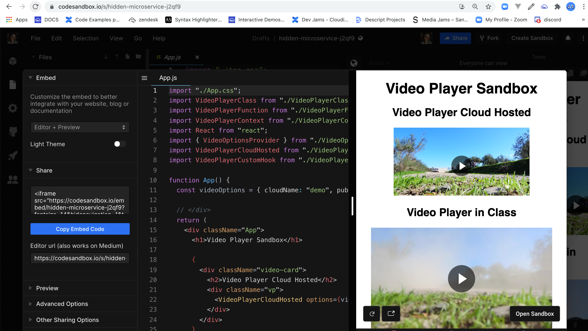

# Getting Started with Create React App

This project was bootstrapped with [Create React App](https://github.com/facebook/create-react-app).

## Run this code locally

`npm install`

`npm run start`  

## Code Sandbox

A forked version of this project can be found on [codesanbox.io](https://codesandbox.io/s/elastic-architecture-stlk6)

[Github Code](https://github.com/rebeccapeltz/react-video-player-alternatives)

[Demo](https://amazing-khorana-ae17ab.netlify.app/)

## Blog

Read the [blog](./blog.md) to discover the purpose of this exercise.