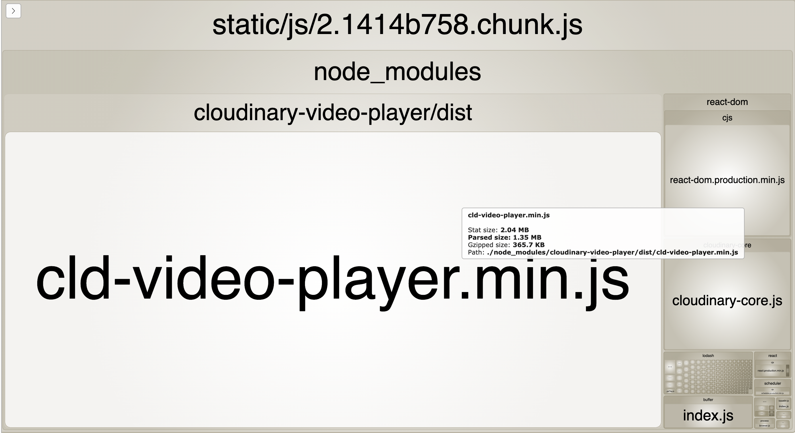

# Integrating Cloudinary Video Player into a React Application

As of this writing [npm trends](https://www.npmtrends.com/react) reports over 10,000 daily downloads of the React library. The [disruption created by Covid in 2020](https://www.weforum.org/agenda/2020/05/coronavirus-covid19-consumers-shopping-goods-economics-industry) is expected to persist. This disruption created consumer demand for video to improve work, shopping, education, healthcare, social intercourse, and entertainment.

It's not surprising that questions arise about how to add a video player to a React application. We'll look at 5 ways to host video with the Cloudinary Video player in a React Component.

## Cloudinary Video Player

The Cloudinary Video Player is a feature enhanced library that builds upon the popular, open source [Video JS](https://videojs.com/) player. Like the Video JS player, it is implemented on a web page by rendering a video tag and then binding Javascript and CSS functionality to the video DOM element.

Cloudinary adds a number of features to the video playing experience including:

- Video manipulations using Cloudinary Video Transformations at the player or video level

- Multiple players per page including playlists created by meta data tagging

- Cloudinary auto formatting transformations so that video is served in the best format for the device or browser on which it is served

- Adaptive Bit Rate Streaming suggested for videos longer than 1 minute to provide HTTP streaming and optimize video resolution in unstable networks

- Customization

- Recommendations lists

- Monetization through interstitial ads

- Shoppable Video

- Analytics

See [Cloudinary Documentation](https://cloudinary.com/documentation/cloudinary_video_player#video_player_features) for more information about these features.

## Cloudinary Video Player Libraries

There are 2 Video Player libraries available: [**Standard** and **Light**](https://cloudinary.com/documentation/cloudinary_video_player#installation_and_setup). The Light library is smaller as it does not include the following features: Adaptive Bitrate Streaming, Video Ads and Shoppable videos. In this exercise, we'll be using the **Light** version.

In addition to the [Video Player](https://www.npmjs.com/package/cloudinary-video-player) library, we'll add the [Cloudinary Core](https://www.npmjs.com/search?q=cloudinary-core) library which is required and supports core Cloudinary functionality like transformations.

Bundle analyzer visualizations provide a look at the JavaScript weight for each alternative.

### Bundle with light option


### Bundle with standard option



## React Components

### JavaScript Challenges

The JavaScript language has presented challenges for developers since its inception. Essentially a functional language created to support asynchronous human interaction in a secured container, it has become the imperative "language of the web". It is sometimes pointed out that the influential book that describes the subset of JavaScript that could be used to write good code, [JavaScript the Good Parts](https://www.oreilly.com/library/view/javascript-the-good/9780596517748/), is only 176 pages - and that includes index and appendices. [Effective Java](https://www.amazon.com/Effective-Java-Joshua-Bloch/dp/0134685997/ref=sr_1_1?dchild=1&keywords=effective+java&qid=1613327876&s=books&sr=1-1), which was similar in helping programmers to better understand how to use the language for which JavaScript's name was derived, is 414 pages.

JavaScript has evolved in many ways.
There are many ways to write good code with JavaScript, for example event handling in callbacks can now take advantages of promises and the async/await syntax.
Still, it is possible for a good developer to write code that is confusing.

### Class Based Components

Originally React components were Class based using [ES6 classes](https://caniuse.com/es6). ES6 classes allow us to encapsulate data and functions similar to the way it would be done in an Object Oriented language like Java. Problems arise in JavaScript context, [`this`](https://developer.mozilla.org/en-US/docs/Web/JavaScript/Reference/Operators/this) was historically bound data generated by click events and other human interaction and did not always behave as desired. React now provides a function based approach to creating components.

In order to bind code to DOM nodes as we will do to host the Video Player, JavaScript code must "listen" for the rendering of the nodes in browser. Class based components are provided notice of events like this using lifecycle hooks such as `componentDidMount`. Code placed in a function like this won't be executed until the HTML provided in the component is actually rendered.

**The Video Player code cannot be bound to the video tag until the HTML video tag is rendered**.

### React Hooks

Functional components run into problems spreading logic over lifecycle hooks. The development of [React Hooks](https://reactjs.org/docs/hooks-intro.html) was prompted by issues arising object oriented encapsulation and life cycle event hooks. The solution: React hooks can hold state and logic, without using the keyword `this`. Hooks can be imported into Component code and changes in state can cause the re-rendering of the component to reflect updated state. As with any functional language, state is immutable.

You can spot a React hook in React code because the convention is to name a function as **use** _Something stateful_. We'll use the following hooks provided by React:

- `useState`  
  Function that returns an immutable data value and a setter that can be used to update it.
- `useEffect`  
  Function that is called once when the component that holds it is rendered and then when any stateful data within it changes. This is helpful for determining that a component has been rendered and in some respect substitutes for the `componentDidMount` and `compoonentDidUpdate` life cycles in a Class function.
- `useContext`
  This function serves as a container for stateful values. It can be passed into a component function to provide state. It defines a provider function made up of useState functions. Having the ability to share context between components is one way to help with inter-component communication.

We'll also create a **custom hook**. Custom hooks are useful for refactoring stateful code that could be reused in many components.

## Exploring Code

We're going to look at different ways to host the Cloudinary Video Player by building components that manage state, logic and event handling.

- Function based component with iframe for embedded cloud hosted video player
- Class based component
- Function based based with useHooks
- Function based component with Context
- Custom hook `useVideoPlayer` that can be used in any component that hosts video

### App.js

The external data for all of the components in this exercise is defined in `App.js`. An object called video options contains the Cloudinary cloudName and publicId. Other video options could be passed to the Video Player components, but for simplicity, these are the only ones that are absolution required to determine the video we want to host

```JavaScript
  const videoOptions = { cloudName: "demo", publicId: "race_road_car" };

```

### Function based Cloud Hosted Video Player

Cloudinary provides a [demo page](https://studio.cloudinary.com/) where you can experiment with Video Player options. Once you are satisfied with the features you have selected, the demo will provide the JavaScript or an embeddable `iframe` with the options set for hosting in the cloud. With this options, you will get a URL with all of the settings including the 2 pieces of data that are required for specifying an asset in Cloudinary; cloud name and the asset's public id.

In the Apps.js you'll find the component JSX for rendering a card containing the name of the component and the video player hosting the video specified in video options. In this case we have a component named `VideoPlayerCloudHosted`.

```JavaScript
{
  <div>
    <h2>Video Player Cloud Hosted</h2>
    <div>
      <VideoPlayerCloudHosted options={videoOptions} />
    </div>
  </div>
}
```

In the code below you can see the URL provided to the `src` attribute contains cloud name and public id as well as all of the options obtained from the Video Player demo page.

In this code cloud name and public id are supplied to the component using `props` passed in from the parent.

```JavaScript
import React from "react";

function VideoPlayerCloudHosted(props) {
  const url = `https://player.cloudinary.com/embed/?public_id=${props.options.publicId}&cloud_name=${props.options.cloudName}&player%5Bfluid%5D=true&player%5Bcontrols%5D=true&source%5Bsource_types%5D%5B0%5D=mp4`;

  return (
    <>
    <div className="iframe-container">
      <iframe className="responsive-iframe"
        title="Cloud Hosted Video Player"
        src={url}
        width="640"
        height="480"
        allow="autoplay; fullscreen; encrypted-media; picture-in-picture"
        allowFullScreen
        frameBorder="0"
      ></iframe>
      </div>
    </>
  );
}
export default VideoPlayerCloudHosted;
```

All we are doing in this functional component is rendering the iframe.  We pass along the `videoOptions` data. 

```html
 {
<div className="video-card">
  <h2>Video Player Cloud Hosted</h2>
  <div className="vp">
    <VideoPlayerCloudHosted options={videoOptions} />
  </div>
</div>
}
```

We do need to add some CSS for a responsive iframe.

```css
.iframe-container {
  position: relative;
  width: 100%;
  overflow: hidden;
  padding-top: 56.25%; /* 16:9 Aspect Ratio */
}

.responsive-iframe {
  position: absolute;
  top: 0;
  left: 0;
  bottom: 0;
  right: 0;
  width: 100%;
  height: 100%;
  border: none;
}
```

### Class Based Component

In `app.js`, we import our Class based video player and render a card that uses the `VideoPlayerClass` component.

```JavaScript
{
  import VideoPlayerClass from "./VideoPlayerClass";

  <div className="video-card">
    <h2>Video Player in Class</h2>
    <div className="vp">
      <VideoPlayerClass />
    </div>
  </div>
}
```

The Class component requires importing libraries to create a Cloudinary Video Player within the component.  The two required libraries are `cloudinary-core` and `cloudinary-video-player`.  We also need to import the css to support the video player. We'll see these imports in the remaining example, which will ultimately justify the creation of a custom hook.

```JavaScript
import React, { Component } from "react";
import { Cloudinary } from "cloudinary-core";
import "cloudinary-video-player/dist/cld-video-player.light.min";
import "cloudinary-video-player/dist/cld-video-player.light.min.css";
```

Next we render the `VideoPlayerClass` component in `app.js`, passing in the videoOptions.

```html

{
  <div className="video-card">
    <h2>Video Player in Class</h2>
    <div className="vp">
      <VideoPlayerClass options={videoOptions} />
    </div>
  </div>
}
```

The `videoOptions` are implicitly read into the React Class based component as `this.props.options`.  The props function matches the `options` attribute supplied in the rendering of the component.

This component implements the code required to initialize the video player and then bind the player to the DOM element which is the first video tag with the class `some-video` in the `videoPlayerInit` function.  The component renders a `video` tag.  It is up to the lifecycle function `componentDidMount` to call the `videoPlayerInit` function once the video tag has been rendered.

```JavaScript
class VideoPlayerClass extends Component {
  cld = () => {
    return new Cloudinary({ cloud_name: this.props.options.cloudName, secure: true });
  };
  videoPlayerInit = () => {
    const cld = this.cld();
    cld.videoPlayer("some-video", {
      publicId: this.props.options.publicId,
      fluid: true,
      controls: true,
      preload: "auto",
      mute: true,
      autoplay: false
    });
  };
  componentDidMount() {
    this.videoPlayerInit();
  }
  render() {
    return (
      <>
        <video id="some-video" />
      </>
    );
  }
}
export default VideoPlayerClass;

```

### Function Based Component

We saw a function based component structure in the Cloud Hosted example.  Now we need to load the libraries and deal with waiting for the video tag to render in a function based approach.  

We start by rendering the component in App.js.

```html
{
  <div className="video-card">
    <h2>Video Player in Function</h2>
    <div className="vp">
      <VideoPlayerFunction options={videoOptions} />
    </div>
  </div>
}
```

Then we import libraries and this should look familiar as its the same code we used in the class based example.

```JavaScript
mport React, { useEffect } from "react";
import { Cloudinary } from "cloudinary-core";
import "cloudinary-video-player/dist/cld-video-player.light.min";
import "cloudinary-video-player/dist/cld-video-player.light.min.css";
```

Next we set up a functional component.  The `videoPlayerInit` function looks the same as it did in the class based approach.  Notice that `props` are pass in to the function rather than being add to the class context implicitly as we saw in the class base function.

Instead of relying on the `componentDidMount` function to tells us that the `video` tag was rendered, we use the `useEffect` functional React Hook to determine this and call the video player init function.

Don't look at `useEffect` as equivalent to `componentDidMount` even though we are using them in a similar manner.  Keep in mind that `useEffect` will be called anytime the component re-renders, so the u'useEffect' functions instructions are executed as if it were called in `componentDidMound` and `componentDidUpdate` in a class base component.  Since we don't want to call the `initVideoPlayer` except when the `video` tag is first rendered, we need to guard against that.  


```JavaScript
function VideoPlayerFunction(props) {
  const cloudinary = new Cloudinary({
    cloud_name: props.options.cloudName,
    secure: true,
  });
  const videoPlayerInit = () => {
    console.log("calling debugger");
    cloudinary.videoPlayer(document.querySelector(".fn-video"), {
      publicId: props.options.publicId,
      fluid: true,
      controls: true,
      preload: "auto",
      mute: true,
      autoplay: false,
    });
  };

  useEffect(() => {
    console.log("calling useEffect");
    videoPlayerInit();
  });
  console.log("calling fn render");
  return (
    <>
      <video className="fn-video" />
    </>
  );
}

export default VideoPlayerFunction;
```

Function Based Component with Context

React provides a hook, `useContext` that includes both `useState` and `Provider` function. The convention for naming the provider is to use the same name as the context object.  In our case we'll have a `VideoOptionsContext` and a `VideoOptionsProvider`. This hook can be used to share logic and state between components.  

Let's start with create the `VideoOptionsContext` component that will hold and provide access to state.  `useState` is a function that return the current value of the state and a setter function that will set a new state value.  We'll capture the options `cloudName` and `publicId` in this context.  

The data is an object that contains these video options. We create the context and name it `VideoOptionsContext.

```JavaScript
const video = { options: { cloudName: "demo", publicId: "race_road_car" } };
export const VideoOptionsContext = createContext();

```

Next we implement and export a `VideoOptionsProvider` which sets up state for the options.  We provide a default value for Video Options which is the `cloudName` and `publicId`.  

```JavaScript
export const VideoOptionsProvider = ({ children }) => {
  const [videoOptions, setVideoOptions] = useState(video.options);

  return (
    <VideoOptionsContext.Provider
      value={{
        videoOptions,
        setVideoOptions,
      }}
    >
      {children}
    </VideoOptionsContext.Provider>
  );
};
```

To use this context in a functional component, we import the `VideoOptionsContext` into `App.js` and wrap the rendering of the `VideoPlayerContext` in this Context component.

```JavaScript
import VideoPlayerContext from "./VideoPlayerContext";
import { VideoOptionsProvider } from "./VideoOptionsContext";

{
<div className="video-card">
  <h2>Video Player in Function with Context Provider</h2>
  <div className="vp">
    <VideoOptionsProvider>
      <VideoPlayerContext />
    </VideoOptionsProvider>
  </div>
</div>
}
```

The `VideoPlayerContext` component resembles the `VideoPlayerFunction` component, except that it get the options from context rather than from props.  

If you examine the code you'll note that we import the `VideoOptionsContext` and then pull the `options` with the `useContext` hook.  Then in code we can reference the options as `options.videoOptions.cloudName` and `options.videoOptions.publicId`.


```JavaScript
import React, { useEffect, useContext } from "react";
import { VideoOptionsContext } from "./VideoOptionsContext";
import { Cloudinary } from "cloudinary-core";
import "cloudinary-video-player/dist/cld-video-player.light.min";
import "cloudinary-video-player/dist/cld-video-player.light.min.css";

function VideoPlayerContext() {
  const options = useContext(VideoOptionsContext);

  const cloudinary = new Cloudinary({
    cloud_name: options.videoOptions.cloudName,
    secure: true,
  });
  const videoPlayerInit = () => {
    console.log("add video player JS");
    const player = cloudinary.videoPlayer(
      document.querySelector(".context-video"),
      {
        publicId: options.videoOptions.publicId,
        fluid: true,
        controls: true,
        preload: "auto",
        mute: true,
        autoplay: false,
      }
    );

    player.on("loadedmetadata", (e) => {
      console.log("app detected", e);
    });
  };

  useEffect(() => {
    console.log("calling useEffect");
    videoPlayerInit();
  });
  console.log("calling fn render");
  return (
    <>
      <video className="context-video" />
    </>
  );
}

export default VideoPlayerContext;

```

The fact that we don't and shouldn't change the cloud name and public id for the video indicates that using Context is not a good idea when working with the video player.  If we were to call `setVideoOptions` we would call `setVideoOptions`.  This would trigger a re-render of the `VideoPlayerContext` component because `useEffect` is run when the state is changed.  Re-rendering the component would reinitialize the video player which is not desirable. 

### Custom Hook